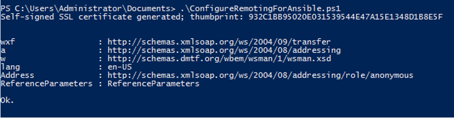

# Intro & Setup

* Winrm stands for Window Remote Management

* Ansible majorly uses Winrm for all remote operations on windows target servers

* All windows machines are by default shipped with Winrm module

* Incase you don’t find Winrm in your windows server you can always install it with below command
	
`winrm quickconfig`

* This command will install Winrm if it is not available

* To have a better connection, Ansible recommends to run this script, which will not only enable WinRM, but also install some necessary certificates for the connection to work.

* You can copy the file from this Github link and run it as PowerShell script with `.ps1 extension`

https://github.com/ansible/ansible/blob/devel/examples/scripts/ConfigureRemotingForAnsible.ps1

* By default Winrm uses 5985 for HTTP call & 5986 for HTTPs call.

* Ansible uses HTTPs to have secure communication thus the port number used here for connection is 5986.

* For Linux machine you just need to install winrm python module - `pip install pywinrm`