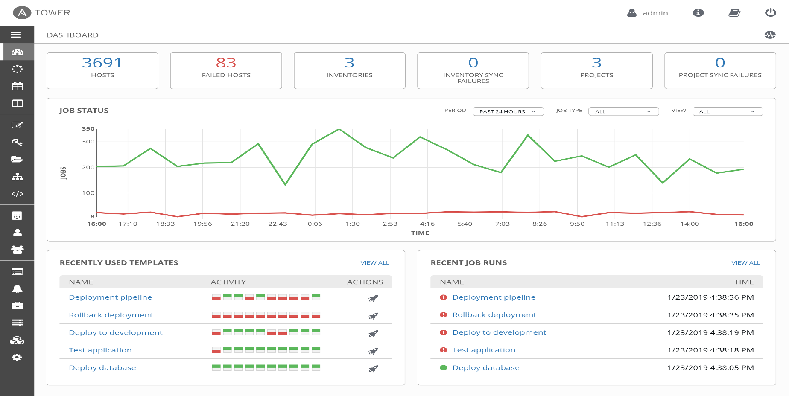
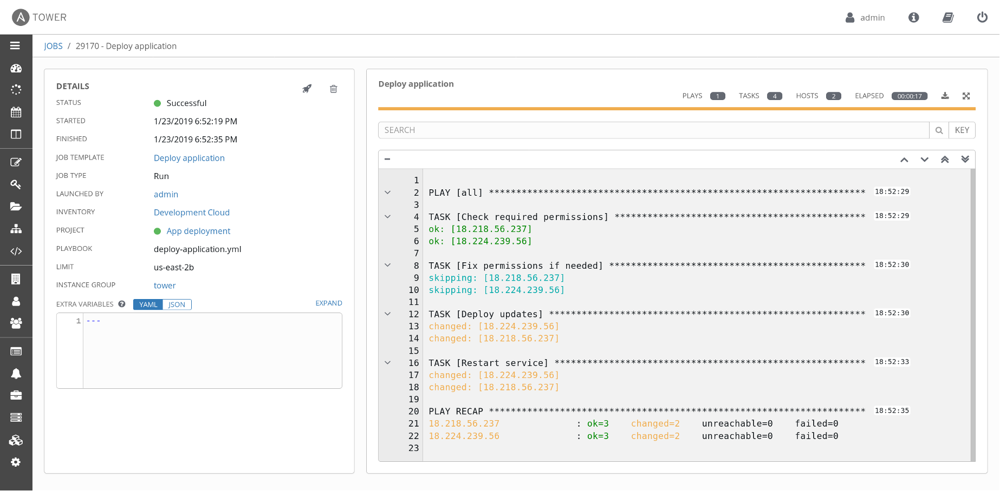

# Ansible tower

* With Red Hat® Ansible® Tower you can centralize and control your IT infrastructure with a visual dashboard

* You can schedule your jobs, integrate notifications

* Easy to manage your inventory in Graphical manner

* Atmost advantage of tower is you can manage your infrastructure in single click of button

* Also it can be easily embed into existing tools and processes with REST API and CLI

* As soon as you log in, you'll see your host and inventory status.

* All the recent job activity triggered.

* Graphical representation of specific job and time ranges of triggered.

* It also gives you the clear visibility of failed and success jobs.

